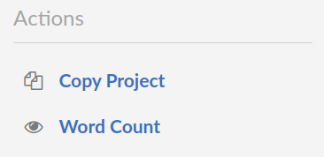

   

  ### 🏫✨ Greek university TeX templates

<!-- frostedpenguin/greek-university-TeX-templates -->

 

 

 
 

  

## 👋 Welcome

Welcome to my LaTeX templates it's a pleasure you are checking out this repo and
I hope you find something useful. 

I have been using LaTeX for all my assignments for the past 2 years and I have found
the process of customizing my documents challenging. So now
that I am officially finishing uni I thought it would be a good idea to share what I
have came up with till now. 

## 👀 Overview
 
 This repository contains 3 different templates for the most common project types a university student may encounter, along with some LaTeX code snippets that I had used in previous projects.

##### The Templates include :
  -  __Homework Template:__ This is primarily focused on homework sheets that
  require you solving a set number of exercises

  - __Thesis Template:__ This just includes the same packages as the homework one
  but with a more _fancy_ title page that allows you to add more information 
  about your paper.

  - __Presentation Template__: This is just the [ ``METROPOLIS`` ](https://github.com/matze/mtheme) beamer theme template with the aueb emblem logo

##### The Snippets include :

- __Code:__ This the _best_ way that I have found of including code snippets in
your documents. Utilizing the minted package that provides syntax highlighting
for a myriad of programming languages.

- __Math:__ This includes more advanced math examples as well as how to
structure and solve big equations.

- __Diagrams:__ This contains mainly tree structures created with the [ forest ](https://ctan.org/pkg/forest?lang=en) and
[ Tikz ](https://ctan.org/pkg/pgf?lang=en) package. This is an extremely non
well documented area of LaTeX and I had to shed a lot of sweat trying to make
them work. There is also examples of how to generate trees with for loops.

## 🔧 Instructions

This project needs _LuaLaTex_ with the shell-escape option to
run.
If you use a plugin that runs with [__latexmk__](https://mg.readthedocs.io/latexmk.html) (like [ VimTex ](https://github.com/lervag/vimtex)
for NeoVim or [ LaTeX Workshop ](https://marketplace.visualstudio.com/items?itemName=James-Yu.latex-workshop) fro visual studio code ) 
I have already included the `.latexmkrc` in every folder so it should run
automatically. 

If on the other hand don't wanna go through the hustle of installing LaTeX to
your machine you can access the project on [overleaf](_https://www.overleaf.com/project/63498ee16d9b477125aa2d8a_).
This is just a _read-only_ link to my project just make sure you create a copy of
it from the project menu as shown below.

  

_NOTE: I am not possessing overleaf premium so the templates are not synced with
the repo therefore there will probably be some lag time in between updates_

## 🙏 Acknowledgments
- [GFS](https://greekfontsociety-gfs.gr/): for their incredible fonts
- [METROPOLIS](https://github.com/matze/mtheme): for their incredible beamer
theme
- [this ntua template](https://www.overleaf.com/project/632b54e93b1a4f79c55549a9): for its awesome thesis title
page
- And of course the LaTeX project that makes this all possible

## 🎁 Contributions

This project is a work in progress, you are more than welcome creating a PR on
adding more university logos or improving and further extending both the
templates and the snippets.

### Peace out 🖖
